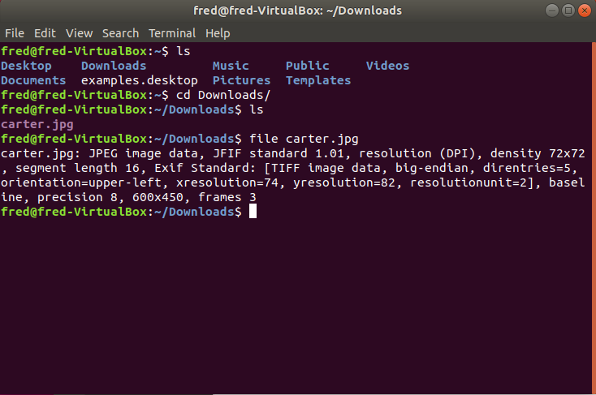
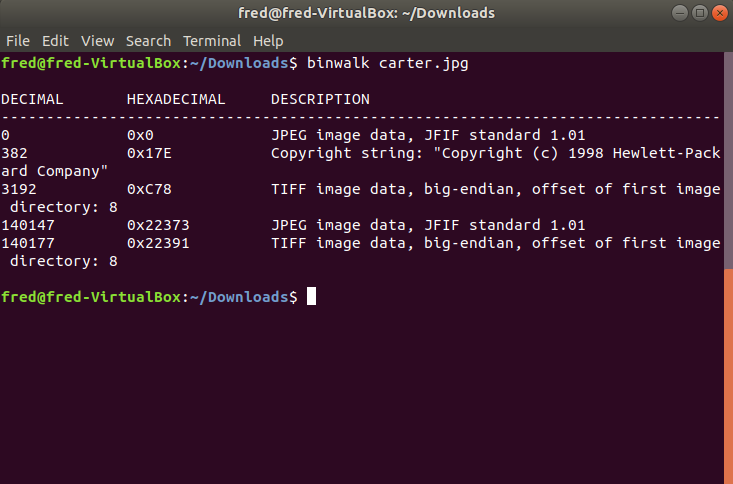
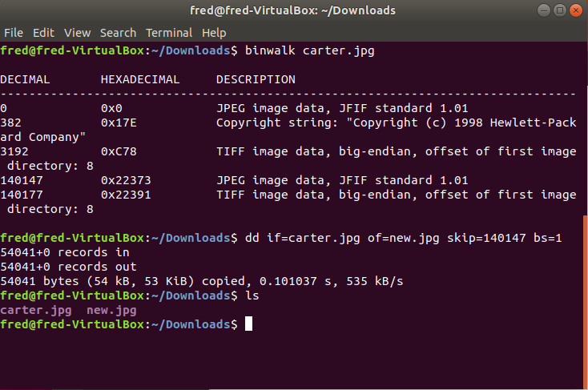
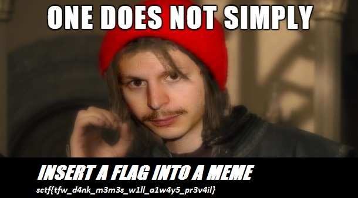

# CTF2018
---#sCTF 2016 Q1 : banana-boy-20---

1.-- 確定檔案格式 --

2.-- 查看檔案內藏的字串 --(猜 CTF/.........)

3.-- 使用binwalk分析檔案--(binwalk carter.jpg)

4.-- 使用dd抽出檔案 --(dd if=carter.jpg of=new.jpg skip=140147 bs=1)

(if是指定輸入檔
 of是指定輸出檔
 skip是指定從輸入檔開頭跳過140147個塊後再開始複製
 bs設置每次讀寫塊的大小為1位元組)

---#ABCTF 2016 : just-open-it---

1.-- 查看檔案內藏的字串 --(猜 CTF/.........)

